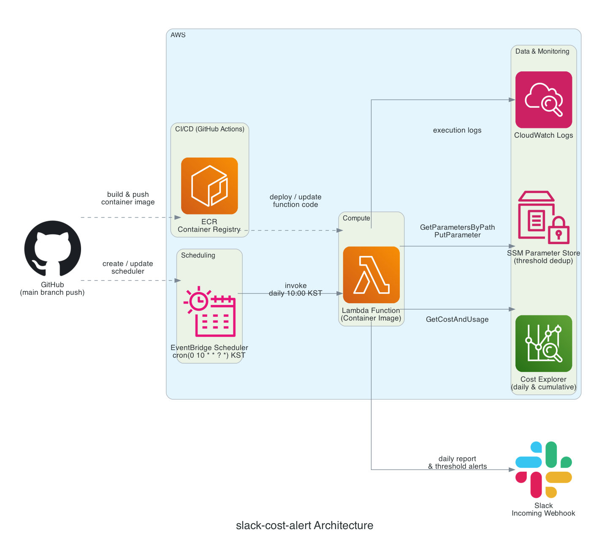

# slack-cost-alert

- Slack Webhook으로 AWS 누적 비용을 보내는 Lambda
- 매일 KST 오전 10시 일일 비용과 누적 비용 전송
- 누적 비용이 예산의 `50%`, `80%`, `90%`를 넘을 때 추가 경고 전송
- 마지막 정기 실행은 2026-05-23 10:00 KST

## 아키텍처

| 구성 요소 | 역할 |
| --- | --- |
| **EventBridge Scheduler** | 매일 오전 10시 KST에 Lambda를 호출 |
| **Lambda** (Container) | 비용 조회 → Slack 전송 → 임계값 체크 |
| **Cost Explorer** | 일일 비용 및 누적 비용 조회 |
| **SSM Parameter Store** | 임계값 알림 중복 전송 방지 |
| **ECR** | 컨테이너 이미지 저장소 |
| **CloudWatch Logs** | Lambda 실행 로그 수집 |
| **GitHub Actions** | CI/CD — 이미지 빌드·푸시, Lambda·Scheduler 배포 |
| **Slack** | 일일 보고 및 임계값 경고 수신 |